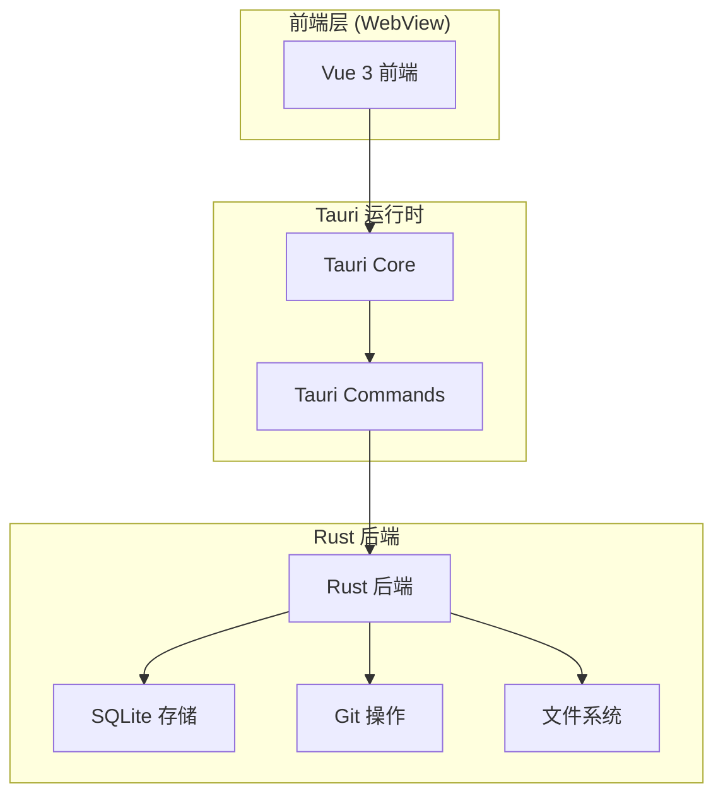
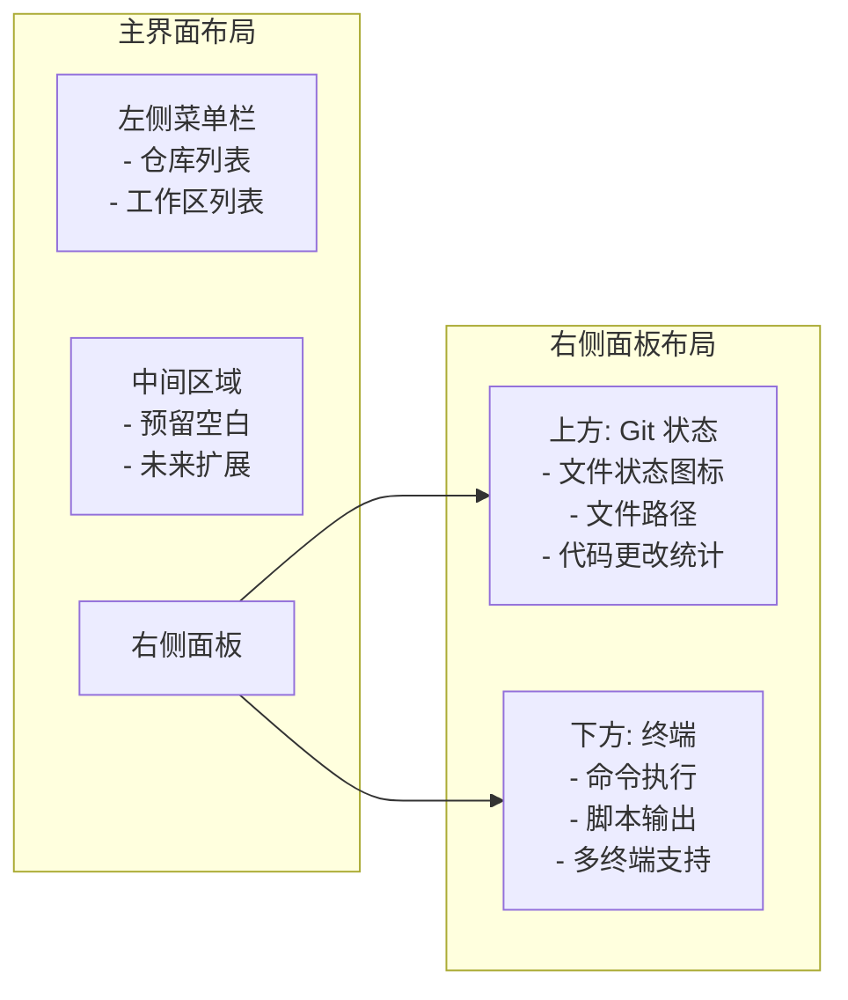
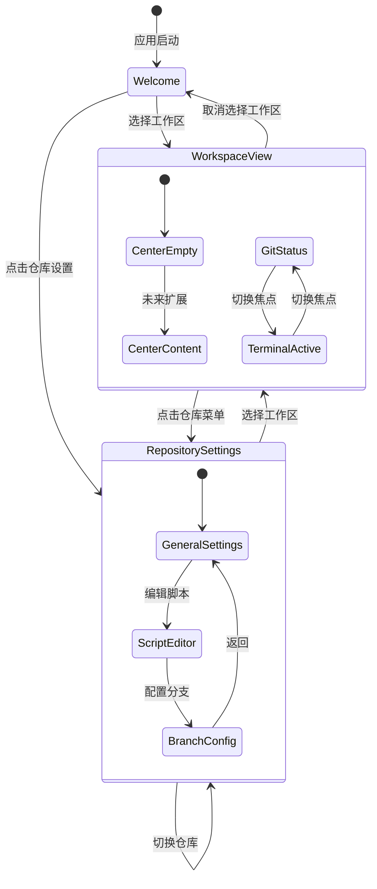

# 设计文档

## 概述

仓库工作区管理器是一个基于 Tauri 的桌面应用程序，利用 Git worktree 功能为开发者提供高效的多分支开发环境管理。应用程序采用 Vue 3 + TypeScript 前端技术栈和 Rust 后端，提供直观的用户界面来管理多个 Git 仓库及其对应的工作区。

## 架构

### 整体架构



### 技术栈选择

- **前端框架**: Vue 3 + TypeScript
- **桌面应用**: Tauri
- **包管理器**: pnpm
- **状态管理**: Pinia
- **UI 组件库**: shadcn-vue
- **样式**: Tailwind CSS
- **Git 操作**: Tauri Commands + Rust (git2)
- **数据存储**: SQLite + Tauri SQL Plugin
- **进程管理**: Tauri Commands + Rust std::process

## 组件和接口

### 核心组件

#### 1. 仓库管理器 (RepositoryManager)

```typescript
interface Repository {
  id: string;
  name: string;
  path: string;
  sourceBranch: string;
  setupScript: string;
  createdAt: Date;
  updatedAt: Date;
}

interface RepositoryManager {
  addRepository(repo: Omit<Repository, 'id' | 'createdAt' | 'updatedAt'>): Promise<Repository>;
  updateRepository(id: string, updates: Partial<Repository>): Promise<Repository>;
  removeRepository(id: string): Promise<void>;
  getRepository(id: string): Promise<Repository | null>;
  listRepositories(): Promise<Repository[]>;
  validateRepository(path: string): Promise<boolean>;
}
```

#### 2. 工作区管理器 (WorkspaceManager)

```typescript
interface Workspace {
  id: string;
  repositoryId: string;
  name: string;
  branchName: string;
  path: string;
  isArchived: boolean;
  createdAt: Date;
  lastAccessedAt: Date;
  gitStats?: {
    additions: number;
    deletions: number;
    currentBranch: string;
  };
}

interface WorkspaceManager {
  createWorkspace(repositoryId: string, name: string): Promise<Workspace>;
  archiveWorkspace(id: string): Promise<void>;
  restoreWorkspace(id: string): Promise<void>;
  removeWorkspace(id: string): Promise<void>;
  getWorkspace(id: string): Promise<Workspace | null>;
  listWorkspaces(repositoryId: string): Promise<Workspace[]>;
  updateGitStats(id: string): Promise<void>;
}
```

#### 3. Git 操作服务 (GitService)

```typescript
interface GitService {
  createWorktree(repoPath: string, branchName: string, worktreePath: string): Promise<void>;
  removeWorktree(worktreePath: string): Promise<void>;
  getGitStats(worktreePath: string): Promise<GitStats>;
  getDetailedGitStatus(worktreePath: string): Promise<GitStatusData>;
  getBranches(repoPath: string): Promise<string[]>;
  getCurrentBranch(worktreePath: string): Promise<string>;
  configureGlobalIgnore(pattern: string): Promise<void>;
}

interface GitStats {
  additions: number;
  deletions: number;
  currentBranch: string;
  hasUncommittedChanges: boolean;
}

interface FileStatus {
  path: string;
  fileName: string;
  status: 'added' | 'modified' | 'deleted' | 'renamed';
  additions: number;
  deletions: number;
}

interface GitStatusData {
  files: FileStatus[];
  totalAdditions: number;
  totalDeletions: number;
  branch: string;
  hasUncommittedChanges: boolean;
}
```

#### 4. 终端服务 (TerminalService)

```typescript
interface TerminalService {
  createTerminal(workingDirectory: string, title?: string): Promise<TerminalInstance>;
  executeCommand(terminalId: string, command: string): Promise<TerminalCommand>;
  getTerminalOutput(terminalId: string): Promise<string>;
  closeTerminal(terminalId: string): Promise<void>;
  listTerminals(): Promise<TerminalInstance[]>;
}

interface TerminalInstance {
  id: string;
  title: string;
  workingDirectory: string;
  isActive: boolean;
  createdAt: Date;
}

interface TerminalCommand {
  command: string;
  output: string;
  exitCode?: number;
  timestamp: Date;
}
```

#### 5. 界面状态管理器 (UIStateManager)

```typescript
interface UIStateManager {
  getCurrentState(): Promise<ViewState>;
  saveState(state: ViewState): Promise<void>;
  switchToWorkspaceView(workspaceId: string): Promise<void>;
  switchToRepositorySettings(repositoryId: string): Promise<void>;
  switchToWelcomeView(): Promise<void>;
  restorePreviousState(): Promise<void>;
}

interface ViewState {
  type: 'welcome' | 'workspace' | 'repository-settings';
  workspaceId?: string;
  repositoryId?: string;
  previousState?: ViewState;
  timestamp: Date;
}

interface ViewTransition {
  from: ViewState;
  to: ViewState;
  preserveState: boolean;
}
```

#### 6. 脚本执行器 (ScriptExecutor)

```typescript
interface ScriptExecutor {
  executeSetupScript(script: string, workingDirectory: string): Promise<ScriptResult>;
  validateScript(script: string): Promise<boolean>;
}

interface ScriptResult {
  success: boolean;
  output: string;
  error?: string;
  exitCode: number;
}
```

## 界面布局设计

### 三栏布局架构



### 界面组件层次结构

```
MainLayout.vue
├── LeftSidebar.vue (始终可见)
│   ├── RepositoryMenu.vue
│   └── WorkspaceList.vue
├── MainContent.vue (动态内容区域)
│   ├── WorkspaceView.vue (工作区模式)
│   │   ├── CenterPanel.vue
│   │   │   └── PlaceholderContent.vue
│   │   └── RightPanel.vue
│   │       ├── GitStatusPanel.vue
│   │       │   ├── FileStatusItem.vue
│   │       │   └── CodeChangesSummary.vue
│   │       └── TerminalPanel.vue
│   │           ├── TerminalTabs.vue
│   │           └── TerminalInstance.vue
│   ├── RepositorySettingsView.vue (仓库设置模式)
│   │   ├── RepositoryConfigForm.vue
│   │   ├── SetupScriptEditor.vue
│   │   └── BranchSelector.vue
│   └── WelcomeView.vue (Workhorse 品牌页面)
│       ├── AnimatedLogo.vue
│       └── ActionBlocks.vue
│           ├── OpenProjectBlock.vue
│           ├── CloneFromGitHubBlock.vue
│           └── CloneFromURLBlock.vue
```

### 界面状态管理



### 用户界面组件

#### 1. 主菜单组件 (MainMenu.vue)

```typescript
interface MainMenuProps {
  repositories: Repository[];
  workspaces: Record<string, Workspace[]>;
}

// Vue 3 Composition API 事件处理
const emit = defineEmits<{
  repositoryClick: [repository: Repository];
  workspaceClick: [workspace: Workspace];
  addRepository: [];
}>();
```

#### 2. 仓库设置对话框 (RepositorySettingsDialog.vue)

```typescript
interface RepositorySettingsDialogProps {
  repository?: Repository;
  isOpen: boolean;
}

const emit = defineEmits<{
  close: [];
  save: [repository: Repository];
}>();
```

#### 3. 工作区创建对话框 (WorkspaceCreateDialog.vue)

```typescript
interface WorkspaceCreateDialogProps {
  repository: Repository;
  isOpen: boolean;
}

const emit = defineEmits<{
  close: [];
  create: [name: string];
}>();
```

#### 4. Git 状态面板 (GitStatusPanel.vue)

```typescript
interface GitStatusPanelProps {
  workspace?: Workspace;
}

interface FileStatus {
  path: string;
  fileName: string;
  status: 'added' | 'modified' | 'deleted' | 'renamed';
  additions: number;
  deletions: number;
}

interface GitStatusData {
  files: FileStatus[];
  totalAdditions: number;
  totalDeletions: number;
  branch: string;
}
```

#### 5. 终端面板 (TerminalPanel.vue)

```typescript
interface TerminalPanelProps {
  workingDirectory?: string;
}

interface TerminalInstance {
  id: string;
  title: string;
  workingDirectory: string;
  isActive: boolean;
}

interface TerminalCommand {
  command: string;
  output: string;
  exitCode?: number;
  timestamp: Date;
}
```

#### 6. 主内容区域 (MainContent.vue)

```typescript
interface MainContentProps {
  currentView: 'welcome' | 'workspace' | 'repository-settings';
  selectedWorkspace?: Workspace;
  selectedRepository?: Repository;
}

interface ViewState {
  type: 'welcome' | 'workspace' | 'repository-settings';
  workspaceId?: string;
  repositoryId?: string;
  previousState?: ViewState;
}

const emit = defineEmits<{
  viewChange: [state: ViewState];
}>();
```

#### 7. 仓库设置视图 (RepositorySettingsView.vue)

```typescript
interface RepositorySettingsViewProps {
  repository: Repository;
  isFullscreen: boolean;
}

interface RepositorySettings {
  name: string;
  sourceBranch: string;
  setupScript: string;
  workhorseDirectory: string;
}

const emit = defineEmits<{
  close: [];
  save: [settings: RepositorySettings];
  switchToWorkspace: [workspaceId: string];
}>();
```

#### 8. 欢迎页面 (WelcomeView.vue)

```typescript
interface WelcomeViewProps {
  isVisible: boolean;
}

interface ActionBlock {
  id: string;
  title: string;
  icon: string;
  description: string;
  action: () => void;
}

const actionBlocks: ActionBlock[] = [
  {
    id: 'open-project',
    title: 'Open Project',
    icon: 'folder',
    description: 'Open an existing Git repository',
    action: () => openProjectDialog()
  },
  {
    id: 'clone-github',
    title: 'Clone from GitHub',
    icon: 'github',
    description: 'Clone a repository from GitHub',
    action: () => openGitHubCloneDialog()
  },
  {
    id: 'clone-url',
    title: 'Clone from URL',
    icon: 'network',
    description: 'Clone a repository from any Git URL',
    action: () => openURLCloneDialog()
  }
];
```

#### 9. 动画化 Logo (AnimatedLogo.vue)

```typescript
interface AnimatedLogoProps {
  size?: 'small' | 'medium' | 'large';
  animationDuration?: number;
  showSubtitle?: boolean;
}

interface LogoAnimation {
  type: 'fadeIn' | 'typewriter' | 'bounce';
  duration: number;
  delay: number;
}

// CSS 动画配置
const logoAnimations = {
  fadeIn: {
    keyframes: '@keyframes fadeIn { from { opacity: 0; } to { opacity: 1; } }',
    duration: '2s',
    easing: 'ease-in-out'
  },
  typewriter: {
    keyframes: '@keyframes typewriter { from { width: 0; } to { width: 100%; } }',
    duration: '3s',
    easing: 'steps(9, end)'
  }
};
```

#### 10. 操作块组件 (ActionBlocks.vue)

```typescript
interface ActionBlocksProps {
  blocks: ActionBlock[];
  layout: 'horizontal' | 'vertical' | 'grid';
}

interface ActionBlockProps {
  title: string;
  icon: string;
  description: string;
  isHovered: boolean;
  isDisabled: boolean;
}

const emit = defineEmits<{
  blockClick: [actionId: string];
  blockHover: [actionId: string, isHovered: boolean];
}>();
```

#### 11. 可调整大小的布局 (ResizableLayout.vue)

```typescript
interface ResizableLayoutProps {
  leftWidth: number;
  rightWidth: number;
  minLeftWidth: number;
  minRightWidth: number;
  maxLeftWidth: number;
  maxRightWidth: number;
}

const emit = defineEmits<{
  resize: [leftWidth: number, rightWidth: number];
}>();
```

#### 7. Tauri Commands 接口

```typescript
// 前端调用 Rust 后端的命令接口
import { invoke } from '@tauri-apps/api/tauri';

interface TauriCommands {
  // 仓库管理
  add_repository: (repo: Omit<Repository, 'id' | 'createdAt' | 'updatedAt'>) => Promise<Repository>;
  create_workspace: (repositoryId: string, name: string) => Promise<Workspace>;
  
  // Git 操作
  get_git_stats: (workspacePath: string) => Promise<GitStats>;
  get_detailed_git_status: (workspacePath: string) => Promise<GitStatusData>;
  clone_repository: (url: string, targetPath: string) => Promise<CloneResult>;
  
  // 项目操作
  open_project_dialog: () => Promise<string | null>;
  validate_git_repository: (path: string) => Promise<boolean>;
  
  // 脚本和终端
  execute_setup_script: (script: string, workingDir: string) => Promise<ScriptResult>;
  create_terminal: (workingDir: string) => Promise<string>;
  execute_terminal_command: (terminalId: string, command: string) => Promise<TerminalCommand>;
}

interface CloneResult {
  success: boolean;
  repositoryPath: string;
  error?: string;
}
```

## 欢迎页面设计规范

### Logo 设计

```css
/* Workhorse Logo 样式 */
.workhorse-logo {
  font-family: 'Inter', 'SF Pro Display', system-ui, sans-serif;
  font-size: 4rem;
  font-weight: 700;
  color: #1a1a1a;
  text-align: center;
  margin-bottom: 3rem;
  
  /* 动画效果 */
  animation: fadeInUp 1.5s ease-out;
  background: linear-gradient(135deg, #667eea 0%, #764ba2 100%);
  -webkit-background-clip: text;
  -webkit-text-fill-color: transparent;
  background-clip: text;
}

@keyframes fadeInUp {
  from {
    opacity: 0;
    transform: translateY(30px);
  }
  to {
    opacity: 1;
    transform: translateY(0);
  }
}
```

### 操作块设计

```css
/* 操作块容器 */
.action-blocks-container {
  display: grid;
  grid-template-columns: repeat(3, 1fr);
  gap: 2rem;
  max-width: 800px;
  margin: 0 auto;
  padding: 2rem;
}

/* 单个操作块 */
.action-block {
  background: white;
  border-radius: 12px;
  padding: 2rem;
  text-align: center;
  cursor: pointer;
  transition: all 0.3s ease;
  border: 2px solid #e5e7eb;
  box-shadow: 0 4px 6px -1px rgba(0, 0, 0, 0.1);
}

.action-block:hover {
  transform: translateY(-4px);
  box-shadow: 0 20px 25px -5px rgba(0, 0, 0, 0.1);
  border-color: #667eea;
}

/* 图标样式 */
.action-block-icon {
  width: 48px;
  height: 48px;
  margin: 0 auto 1rem;
  color: #667eea;
}

/* 标题样式 */
.action-block-title {
  font-size: 1.25rem;
  font-weight: 600;
  color: #1a1a1a;
  margin-bottom: 0.5rem;
}

/* 描述样式 */
.action-block-description {
  font-size: 0.875rem;
  color: #6b7280;
  line-height: 1.5;
}
```

## 数据模型

### 数据库架构

```sql
-- 仓库表
CREATE TABLE repositories (
  id TEXT PRIMARY KEY,
  name TEXT NOT NULL,
  path TEXT NOT NULL UNIQUE,
  source_branch TEXT NOT NULL,
  setup_script TEXT,
  created_at DATETIME DEFAULT CURRENT_TIMESTAMP,
  updated_at DATETIME DEFAULT CURRENT_TIMESTAMP
);

-- 工作区表
CREATE TABLE workspaces (
  id TEXT PRIMARY KEY,
  repository_id TEXT NOT NULL,
  name TEXT NOT NULL,
  branch_name TEXT NOT NULL,
  path TEXT NOT NULL,
  is_archived BOOLEAN DEFAULT FALSE,
  created_at DATETIME DEFAULT CURRENT_TIMESTAMP,
  last_accessed_at DATETIME DEFAULT CURRENT_TIMESTAMP,
  FOREIGN KEY (repository_id) REFERENCES repositories (id) ON DELETE CASCADE,
  UNIQUE(repository_id, name)
);

-- Git 统计缓存表
CREATE TABLE git_stats (
  workspace_id TEXT PRIMARY KEY,
  additions INTEGER DEFAULT 0,
  deletions INTEGER DEFAULT 0,
  current_branch TEXT,
  has_uncommitted_changes BOOLEAN DEFAULT FALSE,
  updated_at DATETIME DEFAULT CURRENT_TIMESTAMP,
  FOREIGN KEY (workspace_id) REFERENCES workspaces (id) ON DELETE CASCADE
);

-- 文件状态表
CREATE TABLE file_status (
  id TEXT PRIMARY KEY,
  workspace_id TEXT NOT NULL,
  file_path TEXT NOT NULL,
  file_name TEXT NOT NULL,
  status TEXT NOT NULL, -- 'added', 'modified', 'deleted', 'renamed'
  additions INTEGER DEFAULT 0,
  deletions INTEGER DEFAULT 0,
  updated_at DATETIME DEFAULT CURRENT_TIMESTAMP,
  FOREIGN KEY (workspace_id) REFERENCES workspaces (id) ON DELETE CASCADE
);

-- 终端实例表
CREATE TABLE terminal_instances (
  id TEXT PRIMARY KEY,
  workspace_id TEXT,
  title TEXT NOT NULL,
  working_directory TEXT NOT NULL,
  is_active BOOLEAN DEFAULT FALSE,
  created_at DATETIME DEFAULT CURRENT_TIMESTAMP,
  FOREIGN KEY (workspace_id) REFERENCES workspaces (id) ON DELETE SET NULL
);

-- 界面布局设置表
CREATE TABLE layout_settings (
  id TEXT PRIMARY KEY DEFAULT 'main',
  left_width INTEGER DEFAULT 300,
  right_width INTEGER DEFAULT 400,
  git_panel_height INTEGER DEFAULT 300,
  terminal_panel_height INTEGER DEFAULT 200,
  updated_at DATETIME DEFAULT CURRENT_TIMESTAMP
);

-- 界面状态表
CREATE TABLE ui_state (
  id TEXT PRIMARY KEY DEFAULT 'main',
  current_view TEXT DEFAULT 'welcome', -- 'welcome', 'workspace', 'repository-settings'
  selected_workspace_id TEXT,
  selected_repository_id TEXT,
  previous_view_state TEXT, -- JSON 格式存储之前的状态
  updated_at DATETIME DEFAULT CURRENT_TIMESTAMP,
  FOREIGN KEY (selected_workspace_id) REFERENCES workspaces (id) ON DELETE SET NULL,
  FOREIGN KEY (selected_repository_id) REFERENCES repositories (id) ON DELETE SET NULL
);
```

### 文件系统结构

```
仓库根目录/
├── .git/
├── .workhorse/           # 工作区存放目录
│   ├── workspace-1/      # 工作区1
│   ├── workspace-2/      # 工作区2
│   └── ...
├── 项目文件...
└── .gitignore           # 包含 .workhorse 忽略规则
```

## 错误处理

### 错误类型定义

```typescript
enum ErrorType {
  REPOSITORY_NOT_FOUND = 'REPOSITORY_NOT_FOUND',
  INVALID_GIT_REPOSITORY = 'INVALID_GIT_REPOSITORY',
  WORKSPACE_ALREADY_EXISTS = 'WORKSPACE_ALREADY_EXISTS',
  GIT_OPERATION_FAILED = 'GIT_OPERATION_FAILED',
  SCRIPT_EXECUTION_FAILED = 'SCRIPT_EXECUTION_FAILED',
  FILE_SYSTEM_ERROR = 'FILE_SYSTEM_ERROR',
  DATABASE_ERROR = 'DATABASE_ERROR'
}

interface AppError {
  type: ErrorType;
  message: string;
  details?: any;
  timestamp: Date;
}
```

### 错误处理策略

1. **Git 操作错误**: 提供详细的错误信息和可能的解决方案
2. **文件系统错误**: 检查权限和磁盘空间，提供相应提示
3. **脚本执行错误**: 显示脚本输出和错误日志
4. **数据库错误**: 提供数据恢复选项
5. **网络错误**: 实现重试机制

## 测试策略

### 单元测试

- **服务层测试**: 测试所有业务逻辑和数据操作
- **Git 操作测试**: 模拟 Git 命令执行和结果处理
- **数据库操作测试**: 测试 CRUD 操作和数据完整性
- **脚本执行测试**: 测试各种脚本场景和错误处理

### 集成测试

- **端到端工作流测试**: 从添加仓库到创建工作区的完整流程
- **Git worktree 集成测试**: 实际的 Git 操作验证
- **文件系统集成测试**: 目录创建、删除和权限测试

### 用户界面测试

- **Vue 组件测试**: 使用 Vue Test Utils + Vitest
- **Tauri 集成测试**: 使用 Tauri 的测试框架测试前后端通信
- **用户交互测试**: 模拟用户操作流程
- **视觉回归测试**: 确保 UI 一致性

### Rust 后端测试

- **单元测试**: 使用 Rust 内置测试框架
- **Tauri Commands 测试**: 测试命令处理逻辑
- **Git 操作测试**: 使用 git2 库进行 Git 操作测试

### 性能测试

- **大量仓库和工作区的性能测试**
- **Git 状态更新的性能优化测试**
- **数据库查询性能测试**

## 安全考虑

### 脚本执行安全

1. **脚本沙箱**: 限制脚本执行权限和访问范围
2. **输入验证**: 验证脚本内容，防止恶意代码注入
3. **执行超时**: 设置脚本执行时间限制
4. **日志记录**: 记录所有脚本执行活动

### 文件系统安全

1. **路径验证**: 防止路径遍历攻击
2. **权限检查**: 确保应用程序有适当的文件系统权限
3. **数据加密**: 敏感配置信息的加密存储

### Git 操作安全

1. **命令注入防护**: 验证和转义 Git 命令参数
2. **仓库验证**: 确保操作的是有效的 Git 仓库
3. **分支保护**: 防止意外删除重要分支